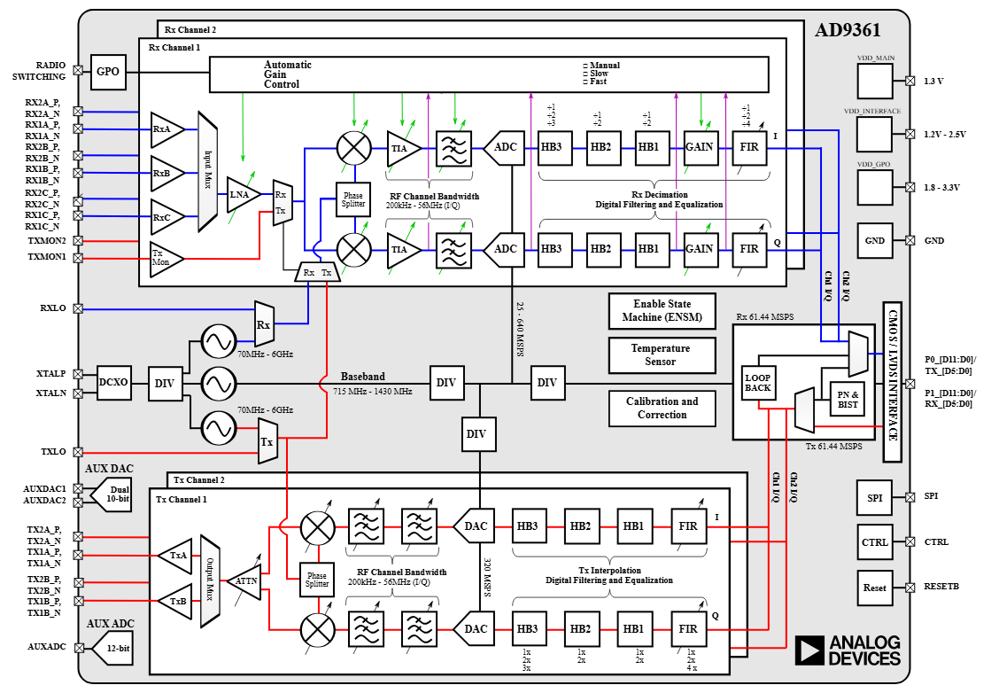

<h1 align="center">𝐻𝒾 𝓉𝒽𝑒𝓇𝑒, 𝐼'𝓂 <a href="https://t.me/Cocosik1558" target="_blank">𝒫𝑒𝓉𝑒𝓇 𝒩𝑔𝓊𝑒𝓃</a> 
</h1>
<h3 align="center">A third-year student at the Faculty of Computer Science at SibSUTIS.</h3>

  

# Учебная практика "SDR" 2026-2027г.

**Практики** находятся в папке [practice](./practice/) и нумеруются по порядку **practice_N**, где **N** - номер практической работы

**Преподаватели** - Ахпашев Р.В.,Калачиков А.А.,Попович И.А.

**!** Материалы, которые здесь обьявлены, составлены и размещены на платформе Yonote, подготовлены преподавательским составом.

## Содержание:

- [Учебная практика "SDR" 2026-2027г.](#учебная-практика-sdr-2026-2027г)
  - [Содержание:](#содержание)
  - [PRACTICE\_1 - Архитектура Adalm Pluto SDR. GNU Radio. Построение радио-приёмника](#practice_1---архитектура-adalm-pluto-sdr-gnu-radio-построение-радио-приёмника)

---

## PRACTICE_1 - Архитектура Adalm Pluto SDR. GNU Radio. Построение радио-приёмника

- Дата: 1-е занятие (8 сентября, вт, 13.45 - 17.25).
- Лекция: Основы структурной схемы цифровой радиосвязи.
- [Папка](./practice/practice_1)
- [Источник](https://sibsutis-rush.yonote.ru/share/bc7d3333-c679-4bb7-881a-9664c2e19313)

---

Кратко

- Вводное занятие. Изучение инструмента [GNURadio](https://ru.wikipedia.org/wiki/GNU_Radio) для разработки ПО в сфере программно-определяемого радио.
- Установка, начало работы, сборка FM-радио приёмника через GNURadio.
- Настройка SDR на FM-диапазон (87.5–108 МГц), вывод звука

---
